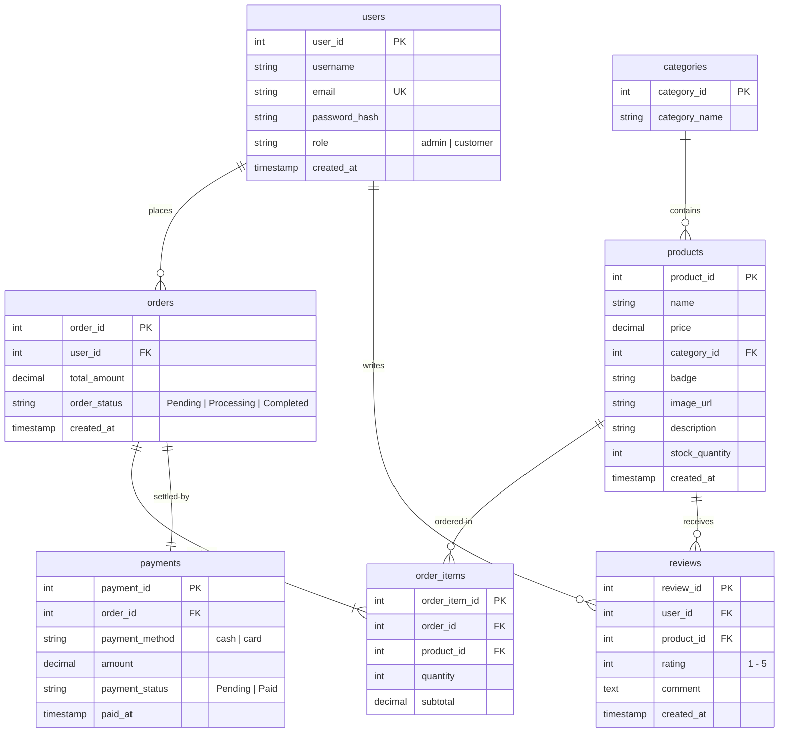

# Plantea E-Commerce – Codebase Overview & System Architecture

This document provides a comprehensive technical breakdown of the **Plantea** online plant nursery application, detailing the folder structure, database design, individual file operations, and JavaScript enhancements.

---

## 📁 Project Directory Structure

```
web-ecommerce-project/
├── admin/                         # Administrative Panels (Protected Routes)
│   ├── includes/
│   │   └── sidebar.php            # Left navigation sidebar for admin views
│   ├── dashboard.php              # Analytics summary & recent orders list
│   ├── orders.php                 # Live order statuses manager & transactions list
│   └── products.php               # Catalog CRUD manager (Create, Read, Update, Delete)
├── assets/                        # Static styling sheets
│   └── css/
│       ├── admin.css              # Custom styling for dashboard elements
│       ├── product.css            # Styles for product detail layouts & reviews
│       ├── shop.css               # Styling for product catalog filters
│       └── style.css              # Global tokens, typography, cart, and forms
├── data/
│   └── sqlDb.php                  # Database schema seeding and table migrations script
├── user-side/                     # Customer-Facing Storefront
│   ├── includes/
│   │   ├── auth.php               # Session validation guards & middleware
│   │   ├── db.php                 # Database connection & global helper functions
│   │   ├── footer.php             # Footer template
│   │   ├── navbar.php             # Contextual header navbar
│   │   └── products.json          # Legacy products backup
│   ├── sections/                  # Homepage modular components
│   │   ├── banners.php            # Secondary marketing banners
│   │   ├── blog.php               # Static blog preview cards
│   │   ├── care.php               # Care instructions block
│   │   ├── features.php           # Core value propositions
│   │   ├── hero.php               # Opening hero banner
│   │   └── products.php           # Featured products carousel
│   ├── cart.php                   # Shopping cart page (interactive AJAX updates)
│   ├── checkout.php               # Transaction-based checkout billing & payments
│   ├── index.php                  # Homepage template aggregator
│   ├── login.php                  # Login form handler
│   ├── logout.php                 # Session destruction handler
│   ├── product.php                # Plant specifications detail & reviews board
│   ├── products.php               # Filterable product grid catalog
│   └── register.php               # Register account form handler
├── README.md                      # Introductory information
└── codebase_overview.md           # [This File] Codebase mapping & architecture guide
```

---

## 🗄️ Database Architecture & Schemas

The application is backed by a **MySQL** relational database named `ecommerce`.

### Relational Schema Diagram


---

## 💻 File Breakdown & Explanations

### 🔐 System Helpers & Configuration

#### `data/sqlDb.php`
- **Purpose**: Creates the `ecommerce` database, sets up the tables, establishes constraints, and seeds 12 default plant listings, categories, and an administrator account (`admin@plantea.com` / `admin123`).

#### `user-side/includes/db.php`
- **Purpose**: Initializes the MySQL database connection with `$conn = mysqli_connect("localhost", "root", "", "ecommerce")`.
- **Functions**:
  - `get_products()`: Retrieves catalog items joined with their category labels.
  - `add_product()`: Inserts a new plant, handling new categories dynamically.
  - `delete_product()`: Drops a product by ID.

#### `user-side/includes/auth.php`
- **Purpose**: Exposes global security helper functions checking `$_SESSION` properties.
- **Functions**:
  - `is_logged_in()`: Returns bool indicating if session has user details.
  - `is_admin()`: Confirms admin clearance role.
  - `require_login($redirect)`: Enforces login requirement, redirecting if unauthorized.
  - `require_admin()`: Enforces admin clearance level, blocking unauthorized traffic.

#### `user-side/includes/navbar.php`
- **Purpose**: Dynamically renders links based on role:
  - Admins see a Gear Icon linking to the Admin Dashboard.
  - Logged-in users see their username, a profile link, and a logout button.
  - Guests see "Login" and "Register".
  - Shows a real-time count badge next to the cart icon based on `$_SESSION['cart']`.

---

### 🛒 Customer-Facing Storefront Pages

#### `user-side/products.php` (Shop Catalog)
- **Purpose**: Displays the plant catalog with filtering by category pills, search inputs, and sort dropdowns.
- **JS Integration**: Intercepts queries to filter the product grid dynamically. Instantly refilters grid list based on search character matches and active category tags in the browser DOM. Recalculates product counters and flips empty catalog state visuals without page reloads.

#### `user-side/product.php` (Product Details & Reviews)
- **Purpose**: Renders botanical descriptions, specifications, stock quantities, and rating aggregates. Implements a user review submission form that updates or saves reviews directly to the DB.
- **JS Integration**: Caps the item selector limits (`+` / `-`) preventing users from ordering less than 1 or more than the active database stock.

#### `user-side/cart.php` (Shopping Cart)
- **Purpose**: Manages cart items stored inside `$_SESSION['cart']`.
- **JS Integration**: Upgrades quantity shifts and deletions to AJAX requests (`fetch()`). Updates the session database in the background, animates item cards with smooth scale-down transitions, and recalculates totals and navbar badges instantly.

#### `user-side/checkout.php` (Checkout Page)
- **Purpose**: Processes customer invoices. Submits orders inside a secure MySQL transaction (`mysqli_begin_transaction`). Deducts purchased quantities from stock levels, updates inventory database entries, logs the order status, records payments, and clears the cart safely.
- **JS Integration**: Switches form views dynamically. Slides the card inputs section open only when "Credit/Debit Card" is selected, updating input `required` validation tags.

#### `user-side/register.php` & `user-side/login.php` (User Management)
- **Purpose**: Authenticates user logins or registers credentials utilizing `password_hash()` and verification.
- **JS Integration**:
  - Adds interactive show/hide password buttons inside the input fields.
  - Integrates a real-time password strength meter utilizing a color-coded bar (Weak, Medium, Strong) dynamically evaluating complexity as they register.

---

### 📊 Admin Panel Pages (Protected Area)

#### `admin/dashboard.php`
- **Purpose**: Generates dynamic database metrics aggregates (Total orders, overall revenues, total unique products count, and active pending orders). Renders a summary list containing the 5 most recent orders joined with the customer table.

#### `admin/products.php`
- **Purpose**: Hosts product addition, catalog inventory listing, and full plant updates. Allows admins to update parameters (badges, prices, botanical details, quantities, and descriptions) and submit them directly via prepared statement queries.

#### `admin/orders.php`
- **Purpose**: Lists all orders placed. Features interactive dropdowns allowing admins to switch status values (Pending, Processing, Completed) which auto-submit on change. Supports order deletion.

---

## 📈 Guide for Future Codebase Changes

1. **Adding new CSS variables or global selectors**: Introduce them into [style.css](file:///home/mahderkassaw/repos/web-ecommerce-project/assets/css/style.css) to preserve theme uniformity.
2. **Implementing Admin Route Guards**: Always call `require_admin()` at the absolute top of new admin PHP views.
3. **Database schema revisions**: Alter the table structures in [sqlDb.php](file:///home/mahderkassaw/repos/web-ecommerce-project/data/sqlDb.php) to ensure migrations remain reproducible.
4. **JS additions**: Keep scripts localized to the foot of their corresponding files inside DOM listener bindings to assure proper event attachments.
